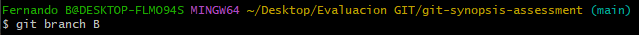
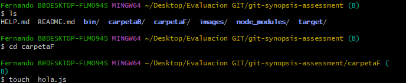
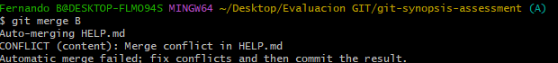
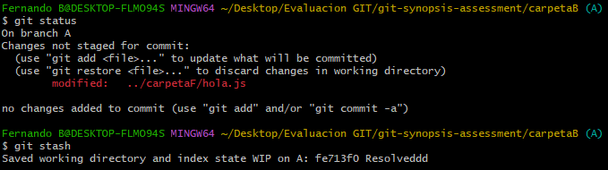
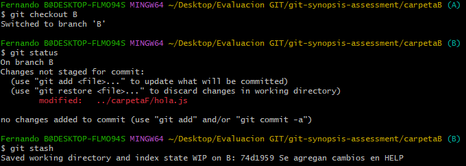
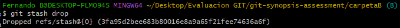
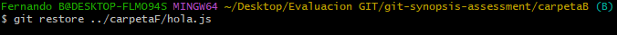

# Solución

## Actividad 1 - se puede visualizar en la rama A

1. Primero se crea un repositorio en la PC(LOCAL) y se inicializa con el comando "git init"

    
    Nota: Se habia inicializado anteriormente, se vuelve a inicializar para el SS de la actividad

2. Se clona el repositorio remoto con la URL en el repositorio local

    
3. Posteriormente ingresamos al directorio donde se encuentra el main y creamos la rama A

    

4. Dentro de la rama A, creamos algunos archivos
    

## Actividad 2 - se visualiza en la rama "main"

## Actividad 3 - se visualiza en la rama "main"

## Actividad 4 - se visualiza en la rama B tanto como en la A

1. Se crea una rama B al igual que la A, en base a main.

    

2. Una nueva modificación a criterio personal, fue crear un archivo nuevo en la carpetaF

    

3. Después de estos cambios en la rama B, estos se cargan a la rama A

    

## Actividad 5 - se visualiza en la rama hotfix/main

## Actividad 6 - se visualiza en la rama A tanto como en la B

1. Modificamos un archivo en la rama A sin hacer commit, pero guardamos los cambios con el comando git stash y posteriormente se revisa el estado de este.

    

2. Nos dirigimos a la rama B, editamos cualquier archivo sin hacer commit

    

3. Para aplicar los cambios debemos ejecutar el comando git stash pop, por lo que aplica los cambios que hemos realizado.

    

4. Por criterio personal, no decido proseguir con los cambios y aplico un git restore para cancelar los cambios

    
