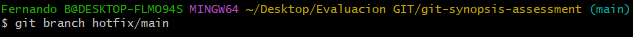
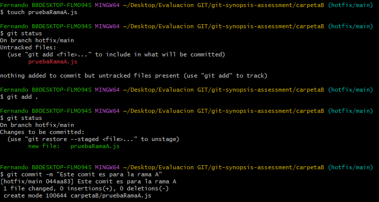
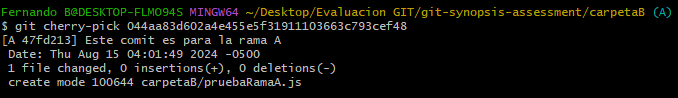

# Solución

## Actividad 1 - se puede visualizar en la rama A

## Actividad 2 - se puede visualizar en la rama "main"

## Actividad 3 - se puede visualizar en la rama "main"

## Actividad 4 - se puede visualizar en la rama A y B

## Actividad 5 

1. Como hotfix/main es un branch, creamos este branch desde main.

    

2. Possteriormente hacemos cualquier modificación para generar un commit.

    

Nota: En el nombre del commit me equivoqué al momento de asignar a “"FIX: issue 2"” y le puse “Este comit es para la rama A”

3. Despues de hacer el commit nos dirigimos a la rama A y usar el comando Cherry-pick solo para aplicar este commit individual.

    