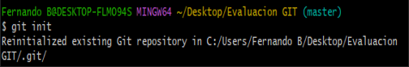

# Solución

## Actividad 1 - se puede visualizar en la rama A

1. Primero se crea un repositorio en la PC(LOCAL) y se inicializa con el comando "git init"

    
    Nota: Se habia inicializado anteriormente, se vuelve a inicializar para el SS de la actividad

2. Se clona el repositorio remoto con la URL en el repositorio local

    
3. Posteriormente ingresamos al directorio donde se encuentra el main y creamos la rama A

    

4. Dentro de la rama A, creamos algunos archivos
    
git
## Actividad 2 - se visualiza en la rama "main"

## Actividad 3 - se visualiza en la rama "main"

## Actividad 4 - se visualiza en la rama B tanto como en la A
